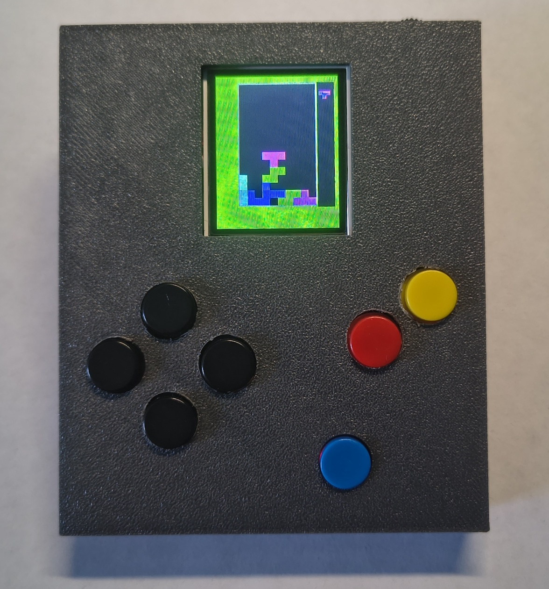
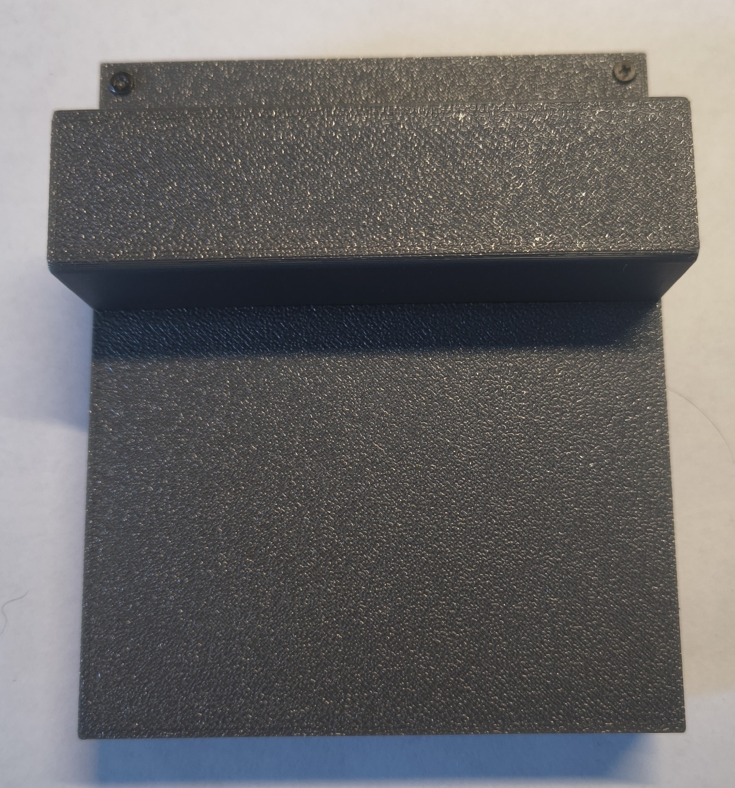
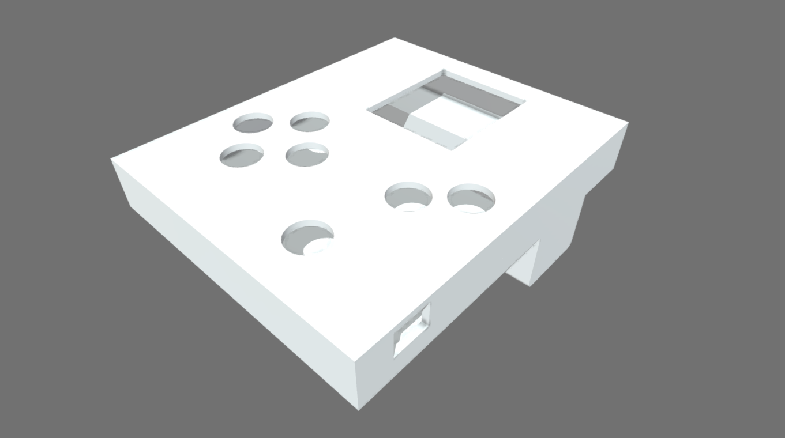

# Konsola
EIT-EP-2024
<p align="center">
  
  
</p>

## Opis
Projekt przedstawia przenośną konsolę do gier opartą o mikrokontroler ATmega328P.
Urządzenie wyposażone jest w kolorowy wyświetlacz TFT LCD 1.8" oraz sześć przycisków sterujących.
Oprogramowanie umożliwia uruchamianie gier kompilowanych jako osobne programy.

## Użyte komponenty
* Mikrokontroler: **ATmega328P**
* Wyświetlacz: **LCD TFT 1.8" SPI ST7735S**
* Zasilanie: **ogniwo Li-Ion 18650**

## Kompilacja gier
Do kompilacji wybranej gry użyj polecenia:
```bash
make <nazwa_gry>
```
Czysty `make` skompiluje `main.c`.

### Gry i dema
| Aplikacja | Kompilacja  |
|-----------|-------------|
| Snake     | `make snake` |
| Tetris    | `make tetris` |
| Demo LCD  | `make demo`|
| Demo Input| `make demo2`|

## Model obudowy
[](https://sketchfab.com/3d-models/obudowa-2c08534e8cd44891bd327603aee7c3e8)
**Kliknij obraz, aby otworzyć interaktywny model 3D na Sketchfab.**

## Aktualnie używane piny
| Rodzaj      | Pin (w kodzie)  | Port ATmega328P | Pin Arduino | Funkcja           |
| :---------- | :-------------- | :-------------- | :---------- | :---------------- |
| **Ekran**   | `PIN_SCK`       | PB5             | D13         | Zegar SPI         |
| **Ekran**   | `PIN_MOSI`      | PB3             | D11         | Dane SPI (SDA)    |
| **Ekran**   | `PIN_CS`        | PB2             | D10         | Chip Select (CS)  |
| **Ekran**   | `PIN_RST`       | PB1             | D9          | Reset (RST)       |
| **Ekran**   | `PIN_DC`        | PB0             | D8          | Data/Command (A0) |
| **Wejście** | `PIN_UP`        | PD2             | D2          | Góra              |
| **Wejście** | `PIN_DOWN`      | PD3             | D3          | Dół               |
| **Wejście** | `PIN_LEFT`      | PD4             | D4          | Lewo              |
| **Wejście** | `PIN_RIGHT`     | PD5             | D5          | Prawo             |
| **Wejście** | `PIN_A`         | PD6             | D6          | Przycisk "A"      |
| **Wejście** | `PIN_B`         | PD7             | D7          | Przycisk "B"      |
>Przyciski są pull-down, ze wspólną masą,
>**Ekran** ma poziom logiczny 3V

## BOM Prototypu
| Lp. | Element | Ilość | Uwagi |
|:---:|---------|:-----:|-------|
| 1 | Arduino Nano | 1 | Mikrokontroler sterujący konsolą |
| 1 | LCD TFT 1.8" SPI ST7735S| 1 | Wyświetlacz* |
| 3 | Płytka uniwersalna 70 × 90 mm | 1 | Płytka do montażu elementów |
| 4 | Ogniwo Samsung INR18650 3400 mAh Li-Ion | 1 | Zasilanie urządzenia |
| 5 | Moduł zasilania USB-C do ogniwa 18650 (5 V) | 1 | Ładowanie i przetwornica 5 V |
| 6 | Przycisk Tact Switch 12 mm | 6 | Przyciski sterujące |
| 7 | Rezystor 10 kΩ | 5 | Rezystory do obniżenia poziomu logicznego |
| 8 | Obudowa drukowana w technologii 3D | 1 | - |
| 9 | Przełącznik dwupozycyjny przesuwny | 1 | Włącznik|
>*Wyświetlacz ma wbudowane rezystory, ale są za słabe.
